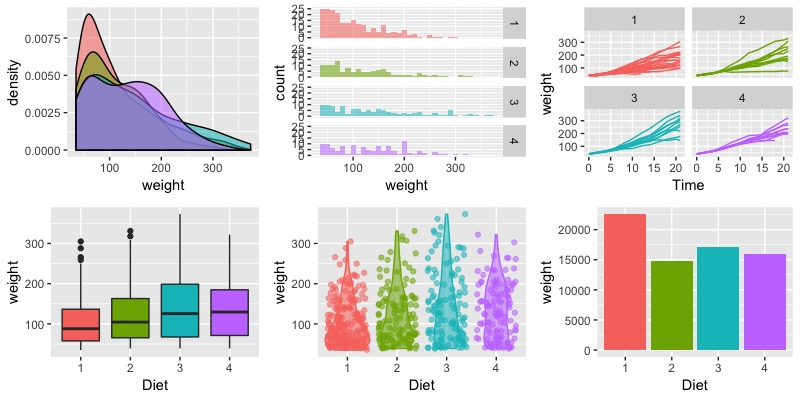
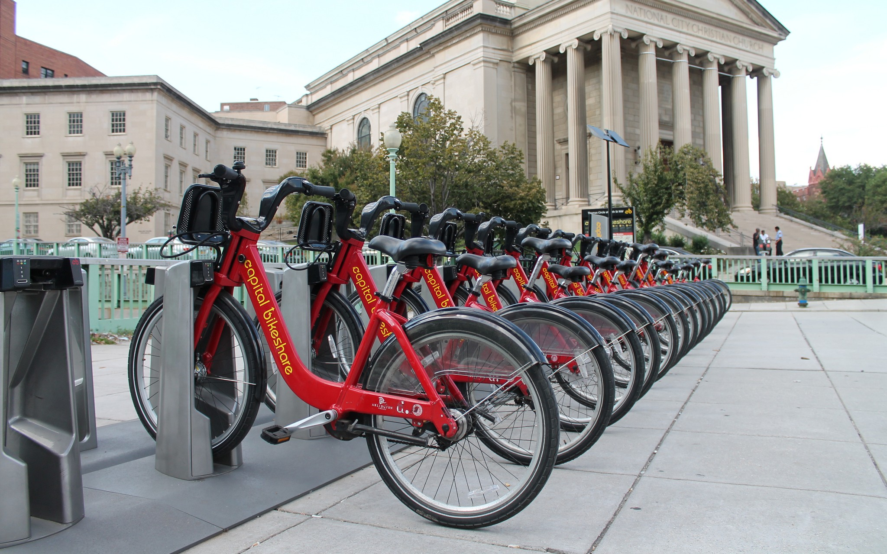
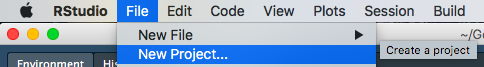
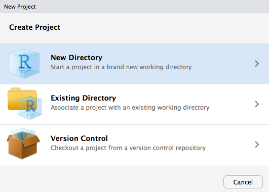
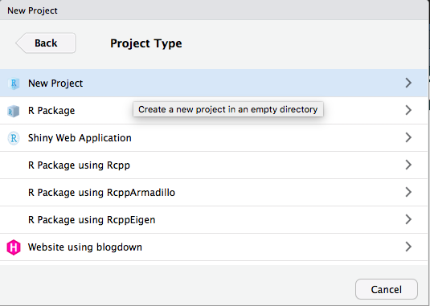
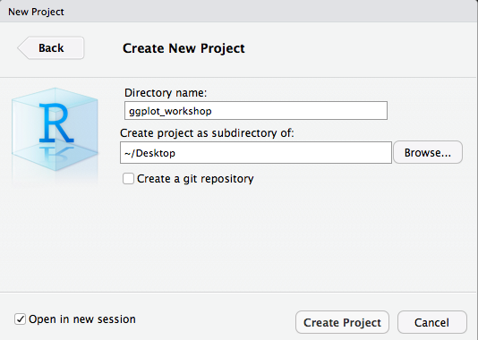
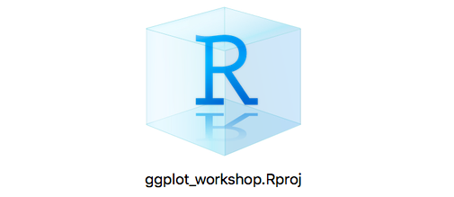
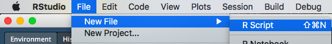
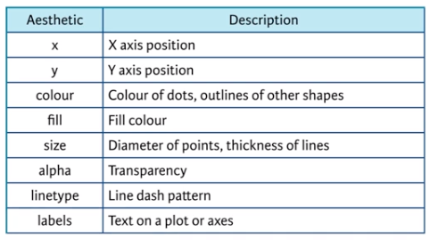
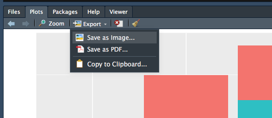

```{r setup, include=FALSE}
options(htmltools.dir.version = FALSE, cache = TRUE)
library(emo)
library(dplyr)
library(ggplot2)
```

# Plan para hoy

.pull-left[
**1. Filosofía de la visualización de datos**

- Exploración versus comunicación
- ¿Qué es ggplot y por qué importa?

**2. Un spoiler de las posibilidades**

**3. Flujo de trabajo**

- RProjects
- Leer los datos
- Mirar los datos
]

.pull-right[
**4. Hacer figuras (¡finalmente!)**

- Setteo básico
- Elementos esenciales
- Gráficos populares
- Customización



]

---
# Los datos para hoy

## http://bit.ly/2H6y4Xz

---
# Filosofía de la visualización de datos

## Exploración versus comunicación

### Exploración:
<center>
<iframe src="https://giphy.com/embed/l4KibOaou932EC7Dy" width="480" height="294" frameBorder="0" class="giphy-embed" allowFullScreen></iframe><p><a href="https://giphy.com/gifs/binoculars-l4KibOaou932EC7Dy">via GIPHY</a></p>
</center>

---
# Filosofía de la visualización de datos

## Exploración versus comunicación

### Comunicación:

<center>
<iframe src="https://giphy.com/embed/3o6Mb4y3SvguAcG3Ly" width="480" height="366" frameBorder="0" class="giphy-embed" allowFullScreen></iframe><p><a href="https://giphy.com/gifs/season-10-the-simpsons-10x22-3o6Mb4y3SvguAcG3Ly">via GIPHY</a></p>
</center>

---
# Filosofía de la visualización de datos
## .hi-pink[gg]plot: .hi-pink[G]rammar of .hi-pink[G]raphics

.pull-left[

]

.pull-right[

### Elementos esenciales del "grammar":
- **Data**: datos que voy a graficar
- **Aesthetics**: escala a la que se asignan los datos
- **Geometries**: elementos visuales usados para los datos
]


---

# ggplot: Grammar of Graphics

Los gráficos se crean de forma aditiva usando .hi-pink[capas]. Suelen verse así:

```{r eval = FALSE}
ggplot(mis_datos, aes(x = mi_x, y = mi_y, color = mi_grupo)) +
     geom_algunaforma() +
     hace_alguna_cosa() +
     hace_alguna_otra_cosa()
```

Cada capa se agrega con un signo de "+"
---

# ¿Cómo funciona?

A lo largo del taller de hoy, utilizaremos una versión modificada del conjunto de datos de [Bike Sharing]((https://www.kaggle.com/marklvl/bike-sharing-dataset#Bike-Sharing-Dataset.zip) de [Kaggle](https://www.kaggle.com/). Este conjunto de datos registra cuántas bicicletas se alquilan diariamente utilizando el sistema de bicicletas compartidas en Washington, D.C.

<center>

</center>


```{r, echo = F, message = FALSE}
library(tidyverse)
bikes <- read.csv("data/bikes_new.csv")
```

---

# ¿Cómo funciona?

## 1. Setteo

.pull-left[
```{r plot-example1, eval = FALSE}
{{ggplot(bikes)}}
```
]

.pull-right[
```{r plot-example-out1, ref.label = "plot-example1", echo = FALSE}

```

]

---

# ¿Cómo funciona?

## 2. Especifico .hi-pink[data] and .hi-pink[aesthetics]

.pull-left[
```{r plot-example2, eval = FALSE}
{{ggplot(bikes, aes(x = temp, y = cnt))}}
```
]

.pull-right[
```{r plot-example-out2, ref.label = "plot-example2", echo = FALSE}

```
]

---

# ¿Cómo funciona?

## 3. Especifico .hi-pink[geometry]

.pull-left[
```{r plot-example3, eval = FALSE}
ggplot(bikes, aes(x = temp, y = cnt)) +
     {{ geom_point() }}
```
]

.pull-right[
```{r plot-example-out3, ref.label = "plot-example3", echo = FALSE}

```
]

---

# ¿Cómo funciona?

## 4. ¡Especifico .hi-pink[otras cosas]!

.pull-left[
```{r plot-example4, eval = FALSE}
ggplot(bikes, aes(x = temp, y = cnt)) +
     geom_point()+
     {{geom_smooth(method = "lm")}}
```
]

.pull-right[
```{r plot-example-out4, ref.label = "plot-example4", echo = FALSE}

```
]
---

# ¿Cómo funciona?

## 5. Lo hago .hi-pink[más lindo]

.pull-left[
```{r plot-example5, eval = FALSE}
ggplot(bikes, aes(x = temp, y = cnt)) +
     {{geom_point(aes(color = season))}}+
     geom_smooth(method = "lm")
```
]

.pull-right[
```{r plot-example-out5, ref.label = "plot-example5", echo = FALSE}

```
]

---

# ¿Cómo funciona?

## 5. Lo hago .hi-pink[más lindo]

.pull-left[
```{r plot-example6, eval = FALSE}
ggplot(bikes, aes(x = temp, y = cnt)) +
     geom_point(aes(color = season))+
     geom_smooth(method = "lm")+
     {{theme_bw()}}
     
```
]

.pull-right[
```{r plot-example-out6, ref.label = "plot-example6", echo = FALSE}

```
]

---
# ¿Cómo funciona?

## 5. Lo hago .hi-pink[más lindo]

.pull-left[
```{r plot-example7, eval = FALSE}
ggplot(bikes, aes(x = temp, y = cnt)) +
     geom_point(aes(color = season))+
     geom_smooth(method = "lm")+
     theme_bw()+
     {{facet_wrap(~ season, scales = "free")}}
     # etc...
```
]

.pull-right[
```{r plot-example-out7, ref.label = "plot-example7", echo = FALSE}

```
]

---
# Flujo de trabajo: R Projects

- [R Studio Projects](https://support.rstudio.com/hc/en-us/articles/200526207-Using-Projects) permite crear .hi-pink[projects] en un directorio dado
- Beneficios: 
     - No hay que especificar el directorio de trabajo
     - Todo es "lindo y bien contenido"
     - Podés abrir varios proyectos a la vez
     - Agarra las cosas donde las dejaste (pestañas abiertas, ambiente, etc.) cuando reabrís el proyecto
---

# Ejercicio 1: Hacer un R Project

.middle[

En el mismo directorio que el archivo .Rproj, se incluye:
- los datos bikes.csv
- un nuevo script .R 
]
---

# Ejercicio 1: Hacer un R Project

### Paso 1:
.middle[

]
---

# Ejercicio 1: Hacer un R Project


### Paso 2:
.middle[

]
---

# Ejercicio 1: Hacer un R Project

### Paso 3:
.middle[

]
---

# Ejercicio 1: Hacer un R Project

.pull-left[

En el mismo directorio que el archivo .Rproj, incluir:
- los datos bikes.csv
- un script .R script llamado bikes.R
]

.pull-right[
### Paso 4:

]

---

# Ejercicio 1: Hacer un R Project

.pull-left[

En el mismo directorio que el archivo .Rproj, incluir:
- **los datos bikes.csv**
     - Mover el archivo al directorio que recién creaste
- **un script .R llamado bikes.R**
     - Abrir el archivo nuevo ggplot_workshop.rproj file, crea un script de R y guardalo en el mismo directorio que tu proyecto y datos.
]

.pull-right[
### Paso 5:




]

---
# Ejercicio 2: cargar los datos

En el nuevo script incluí las siguientes líneas:

```
# Lee los datos
bikes <- read.csv("bikes_new.csv")
```

Cualquier cosa precedida por un `#` será un .hi-pink[comentario], o sea, R no va a tratar de correrlo.

---

# Ejercicio 3: explorar los datos

Veamos qué hacen los siguientes comandos:

```
View(bikes)
str(bikes)
summary(bikes)
```

---
# Ejercicio 3: explorando los datos


.pull-left[
```{r eval = FALSE}
{{View(bikes)}}
str(bikes)
summary(bikes)
```
]

.pull-right[
- Te deja ver tus datos en un panel
- Se ve y se siente como Excel
]

---
# Ejercicio 3: explorando los datos


.pull-left[
```{r eval = FALSE}
View(bikes)
{{str(bikes)}}
summary(bikes)
```
]

.pull-right[

- Te da un desglose de cada variable (columna):
     - Nombre, tipo de variable, puntos de datos (filas)

]

```{r echo = FALSE}
bikes <- read.csv("data/bikes_new.csv")
str(bikes)
```

---

# Ejercicio 3: explorando los datos

.pull-left[
```{r eval = FALSE}
View(bikes)
str(bikes)
{{summary(bikes)}}
```
]

.pull-right[

- Da un resumen de cada variable:
     - **Si es númerica**: estadísticos descriptivos (min/max, quartiles, media)
     - **Si es un factor**: niveles de los factores y cantidad de observaciones en cada nivel
]

```{r echo = FALSE}
summary(bikes)
```

---

# Nota rápida sobre "datos tidy"

- En general, los "datos tidy" hacen que sea más sencillo gráficar (entre otras cosas)
- **Datos tidy** implica que cada fila *es una única observación* y cada columna es *una única variable*

---

# Cargar librerías

- En el script ggplot_workshop.R, agregar una línea al principio que cargue las librerías que vamos a utilizar

```
library(ggplot2)
```

- Quizá primero deben instalar ggplot2. Si obtienen un error diciendo  *there is no package called 'ggplot2'*, correr lo siguiente en la consola:

```
install.packages("ggplot2")
```
---

# Elementos esenciales

Ahora construiremos una figura de forma iterativa en ggplot

### Recordemos:
```{r eval = FALSE}
ggplot(mis_datos, 
       aes(x = mi_x, y = mi_y, color = mi_grupo)) +
       geom_algunaforma() +
       hace_alguna_cosa() +
       hace_alguna_otra_cosa()
```

---
# Elementos esenciales

.pull-left[
## Empezando

```{r plot-setup-1, eval = FALSE}
{{ggplot(bikes)}}
```
]

.pull-right[
```{r plot-setup-1-out, ref.label = "plot-setup-1", echo = FALSE}

```
]

---
# Elementos esenciales: aesthetics


.pull-left[
```{r plot-setup-2, eval = FALSE}
{{ggplot(bikes) + 
         aes(x = temp, 
             y = count)}}
```

Recordemos cuando estábamos explorando los datos...
     - `count`: número de bicicletas alquiladas/día
     - `temp`: la temperatura (F) ese día
- Ahora asignaremos esas variables a nuestra .hi-pink[aesthetics]
- Tenga en cuenta qué cambios: todavía no hay datos porque no hemos especificado .hi-pink[cómo] esos datos aparecerán (esa es la .hi-pink[geometría])
]

.pull-right[
```{r plot-setup-2-out, ref.label = "plot-setup-2", echo = FALSE}

```

- Notar el .hi-pink[+] al final de la primera línea - estamos agregando una nueva capa .hi-pink[layer]
]

---
# Elementos esenciales: geometry

.pull-left[
```{r plot-setup-3, eval = FALSE}
ggplot(bikes) +
       aes(x = temp, 
           y = count) +
     {{geom_point()}}
     
```


- Ahora especificaremos la .hi-pink[geometry] de nuestro gráfico, es decir, cómo queremos que se representen los datos
- Trazaremos nuestros datos como puntos por ahora
- Pronto veremos más geometrías (llamadas .hi-pink[geoms] y especificadas como `geom_tipo()`)

]

.pull-right[
```{r plot-setup-3-out, ref.label = "plot-setup-3", echo = FALSE}

```

]

---
# Explorando otras aesthetics

- Ahora que tenemos una trama básica, es posible que deseemos agregarle otros atributos informativos.
- Por ejemplo, podríamos asignar otra variable a una estética como `color`,` size`, `alpha`, etc.


<center>

</center>

Vea una explicación completa de las especificaciones estéticas de ggplot [aquí.](https://ggplot2.tidyverse.org/articles/ggplot2-specs.html)
---

# Explorando otras aesthetics

```{r eval = FALSE}
ggplot(bikes)+ 
       aes(x = temp, 
           y = count, 
           {{color = season}}, 
           {{size = holiday}}) +
     geom_point()
```

En el ejemplo anterior, hemos mapeado:

- `color` a la variable `season` (variable categórica con niveles "otoño", "invierno", "verano", "primavera")
- `size` a la variable `holiday` (variable categórica con niveles 0 o 1, que indica si ese día fue un día festivo o no)

---
# Explorando otras aesthetics
.pull-left[

```{r plot-setup-4, eval = FALSE}
ggplot(bikes, 
       aes(x = temp, 
           y = count, 
           {{color = season}})) +
     geom_point()
     
```

- Aviso: dentro de la función `aes()`, no estamos agregando *capas*; las nuevas estéticas dentro de () se agregan con comas. Esto todavía es parte de la función básica `ggplot()`
]


.pull-right[
```{r plot-setup-4-out, echo = FALSE}
ggplot(bikes, 
       aes(x = temp, 
           y = count, 
           color = season)) +
     geom_point()
```

]

---
# Ejercicio 4: agregando aesthetics

Intenten modificar la gráfica actual asignando `alpha` (transparencia) a `windspeed`

.pull-left[
```{r plot-ex5, eval=FALSE}
ggplot(bikes, 
       aes(x = temp, 
           y = count, 
           color = season,
           {{alpha = windspeed}})) +
     geom_point()
     
```
]

.pull-right[
```{r plot-ex5-out, echo = FALSE}
ggplot(bikes, 
       aes(x = temp, 
           y = count, 
           color = season,
           alpha = windspeed)) +
     geom_point()
```
]
---

# Más customización de aesthetics

- los colores por defecto de ggplot son lindos, pero... ¿y si queremos definir nuestros propias paletas?

> Una nueva capa: `scale_color_manual()`

- También: `scale_color_continuous`, `scale_color_discrete`, y muchos otros...

---
# Más customización de aesthetics

### Nombrar colores

`scale_color_manual(values = c("red", "blue", "yellow", "green"))`

### Referenciar los códigos de color hex

`scale_color_manual(values = c("#d80e0e", "#1f0ed8",  "#ecee1e", "#11cc3a"))`

`mis_colores <- c("#d80e0e", "#1f0ed8",  "#ecee1e", "#11cc3a")`
`scale_color_manual(values = mis_colores)`

#### Usar paletas predefinidas

`scale_color_brewer(palette = "Set1")`

```
library(wesanderson)

plot + scale_color_manual(values = wes_palette(n = 4, name = "Moonrise3"))`
```

---
# Más customización de aesthetics

- Tengan en cuenta que hemos mapeado la estética a las variables en estos ejemplos. También podría establecer la estética como atributos *estáticos* (es decir, establecer el color de todos los puntos en *rojo* en lugar de en una variable).

- Acabamos de ver un pequeño aspecto de los cambios estéticos. Pueden consultar la [documentación de ggplot](https://ggplot2.tidyverse.org/articles/ggplot2-specs.html) para obtener más información.

---

# Explorando geometries


- .hi-pink[Geometrías]: cómo se representan los datos, es decir, el *tipo* de gráfico (dispersión, barra, línea, etc.)

- La geometría que elijo es importante y debe reflejar la estructura de las relaciones en los datos que desea mostrar.

- Hay [.hi-pink[muchísimos]](https://ggplot2.tidyverse.org/reference/#section-layer-geoms). Aquí hay algunos ejemplos de uso común. Recorreremos algunos de estos.

     - geom_point()
     - geom_line()
     - geom_bar()
     - geom_violin()
     - geom_boxplot()
     - geom_density()
     - geom_smooth()
     - geom_ridgeline()

---

# Geometries: x, y continuos
.pull-left[
```{r point, eval = FALSE, message = F}
p <- ggplot(bikes) +
       aes(x = temp, 
           y = count)

p + 
     {{geom_point()}}
```
]

.pull-right[
```{r point-out, ref.label = "point", echo = FALSE, message = F}

```
]

---
# Geometries: x, y continuos

.pull-left[
```
p + 
     {{geom_smooth()}}
```
]

.pull-right[
```{r echo = FALSE, message = F}
p + geom_smooth()
```
]

---
# Geometries: x, y continuos

.hi-pink[¡Combinando geoms!]

.pull-left[
```{r, eval = FALSE, message = F}
p + 
     {{geom_point()}} +
     {{geom_smooth()}}
```
]
.pull-right[
```{r, echo = FALSE, message = F}
p + geom_point() +
     geom_smooth()
```
]

---
# Geometries: x categórica, y continua

.pull-left[
```{r eval = FALSE, message = F}
p <- ggplot(bikes) +
     aes(x = season,
         y = count)

p + 
     {{geom_boxplot()}}
```
]

.pull-right[
```{r echo = FALSE, message = F}
p <- ggplot(bikes) +
     aes(x = season,
         y = count)

p + geom_boxplot()
```
]
---
# Geometries: x categórica, y continuas

.pull-left[
```
p + {{geom_violin()}}
```
]

.pull-right[
```{r echo = FALSE, message = F}
p + 
     geom_violin()
```

]
---
# Geometries: x categórica, y continua

.pull-left[

.hi-pink[¡Combinando geoms!]

```{r, eval = FALSE, message = F}
p + 
     {{geom_violin()}} +
     {{geom_jitter(alpha = 0.25)}}

```

- `geom_jitter()` es básicamente `geom_point()` pero los puntos se dispersan para hacerlos más visibles
- aquí también hemos especificado el aesthetic `alpha` como un constante .hi-pink[atributo] dentro de la geom.
]

.pull-right[
```{r, echo = FALSE, message = F}
p + 
     geom_violin() +
     geom_jitter(alpha = 0.25)

```
]

---
# Geometries: histogramas y densidad

.pull-left[
```{r eval = FALSE, message = F}
p <- ggplot(bikes) +
     aes(x = temp)

p + 
     {{geom_histogram()}}
```
]

.pull-right[
```{r echo = FALSE, message = F}
p <- ggplot(bikes) +
     aes(x = temp)

p + 
     geom_histogram()
```
]
---

# Geometries: histogramas y densidad

.pull-left[
```{r eval = FALSE, message = F}
p + 
     {{geom_freqpoly()}}
```
]

.pull-right[
```{r echo = FALSE, message = F}
p+geom_freqpoly()
```

]

---
# Geometries: histogramas y densidad

.pull-left[
```{r density-plot, eval = FALSE, message = F}
p + 
     {{geom_density()}}
```
]

.pull-right[
```{r density-plot-out, ref.label = "density-plot", echo = FALSE, message = F}

```

]

---

# Geometries: histogramas y densidad

.pull-left[
```{r, eval = FALSE, message = F}
p <- ggplot(bikes) +
     aes(x = temp,
         {{fill = season}},
         {{alpha = 0.25}})
p + geom_density()
```
]

.pull-right[
```{r, echo = FALSE, message = F}
p <- ggplot(bikes) +
     aes(x = temp,
         fill = season,
         alpha = 0.25)
p + geom_density()
```
]

- ¿Qué pasaría si especificamos `color`en vez de `fill` para este geom?
---
# Geometries: x continua, y categórica

.pull-left[
```{r joyplot, eval = FALSE, message = F}

#install.packages("ggridges")
library(ggridges)
p <- ggplot(bikes) + 
     aes(x = temp, 
         y = season)

p + geom_density_ridges()
```
]

.pull-right[
```{r joyplot-out, ref.label="joyplot", echo = FALSE, message = F}

```

]


---
# Gráficos de resúmen


.pull-left[
Hasta ahora vimos gráficos de datos "crudos" pero a veces podemos querer ver figuras de resúmen. Para eso tenemos que manipular los datos primero.

```{r}
bikes$season <- factor(bikes$season, levels = c("winter", "spring", "summer", "fall"))

bikes_summary <- bikes %>%
  group_by(season, type) %>% 
  summarise(count = mean(count))

```
]

.pull-right[
```{r}
bikes_summary
```

]

---
# Gráficos de resúmen

.pull-left[
Ahora con nuestros datos resumidos (`bikes_summary`)...

```{r bar, eval = FALSE, message = F}
ggplot(bikes_summary) +
     aes(x = season, y = count) +
     geom_bar(stat = "identity")
```
]

.pull-right[
```{r bar-out, ref.label="bar", echo = FALSE, message = F}

```

]
---
# Gráficos de resúmen

.pull-left[
Ahora con nuestros datos resumidos (`bikes_summary`)...

```{r bar-fill, eval = FALSE, message = F}
ggplot(bikes_summary) +
     aes(x = season, y = count, fill = type) +
     geom_bar(stat = "identity")
```
]

.pull-right[
```{r bar-fill-out, ref.label="bar-fill", echo = FALSE, message = F}

```

]

---
# Gráficos de resúmen

.pull-left[
Ahora con nuestros datos resumidos (`bikes_summary`)...

```{r line, eval = FALSE}
ggplot(bikes_summary) +
     aes(x = season, y = count, color = type) +
     geom_point()+
     {{geom_line(aes(group = type))}}
```
]

.pull-right[
```{r line-out, ref.label="line", echo = FALSE, message = F}

```

]

---
# Facets

- Además de los aesthetics, otra forma de distinguir diferentes elementos de nuestros datos es separarlos en paneles.
- .hi-pink[Facets] nos permiten hacer eso.

.pull-left[
Con nuestros datos resumidos (`bikes_summary`)...

```{r bar-fill-facet, eval = FALSE, message = F}
ggplot(bikes_summary) +
     aes(x = season, y = count, fill = type) +
     geom_bar(stat = "identity") +
     {{facet_wrap(~ type)}}
```

]

.pull-right[
```{r bar-fill-facet-out, ref.label="bar-fill-facet", echo = FALSE}

```

]

---
# Facets

- Además de los aesthetics, otra forma de distinguir diferentes elementos de nuestros datos es separarlos en paneles.
- .hi-pink[Facets] nos permiten hacer eso.

.pull-left[
Con nuestros datos resumidos (`bikes_summary`)...

```{r bar-fill-facet2, eval = FALSE, message = F}
ggplot(bikes_summary) +
     aes(x = season, y = count, fill = type) +
     geom_bar(stat = "identity") +
     {{facet_grid(season ~ type, scales = "free")}}
```

]

.pull-right[
```{r bar-fill-facet2-out, ref.label="bar-fill-facet2", echo = FALSE}

```

]


---
# Hacer más lindos los gráficos: labels

.pull-left[
```{r labs-example, eval = FALSE, message = F}
p +
     {{labs(title = "Número de bicis alquiladas por estación",
          x = "Estación",
          y = "Número de bicis alquiladas",
          fill = "Tipo de alquiler")}}
```
]

.pull-right[
```{r labs-example-out, ref.label="labs-example", echo = FALSE, message = F}

```

]

---
# Explorando opciones de tema

- Otra capa importante es la capa [`theme()`](https://ggplot2.tidyverse.org/reference/theme.html), que permite controlar todos los componentes que no son de datos de la figura.

---
# Explorando opciones de tema

- Las funciones de ayuda a veces se utilizan para especificar opciones de tema. Estos comienzan con `element_`:
     - Por ejemplo, `element_text()` admite opciones de tema para modificar el texto

- Un ejemplo de sintaxis:

`theme(texto.a.cambiar = element_text(font = "fuente", size = 12, etc...))`

- Se pueden configurar las opciones de tema gráfico a gráfico o se pueden definir temas personalizados con `theme_set()`

---
# Opciones de tema: algunos ejemplos

.pull-left[
```{r theme-examples, eval = FALSE}
p + 
     {{theme(axis.title = element_text(size=18),
             axis.text.x = element_text(size=12),
             legend.title = element_text(size=12),
             legend.position = "bottom")}}
```
]

.pull-right[
```{r theme-examples-out, ref.label="theme-examples", echo = FALSE}

```

]

---
# Salvando

.pull-left[
## Opción 1:


]

--
.pull-right[
## Opción 2: [ggsave](https://ggplot2.tidyverse.org/reference/ggsave.html)


```{r eval = FALSE}
my_plot <- ggplot(bikes_summary) +
     aes(x = season, 
         y = count, 
         fill = type) +
     geom_bar(stat = "identity")

ggsave("my_grafico.png", width = 4)
```

- No se necesita especificar el directorio si está utilizando proyectos R
- Puede especificar un directorio relativo (por ejemplo, imágenes/...)
]

---
# Otras

### Random
- [portafolio de gráficos](https://www.r-graph-gallery.com/)
- [gganimate]()

### Colores
- [paletter package](http://djnavarro.net/post/2018-06-14-paletter/)
- [colorbrewer](http://colorbrewer2.org/#type=sequential&scheme=BuGn&n=3)

